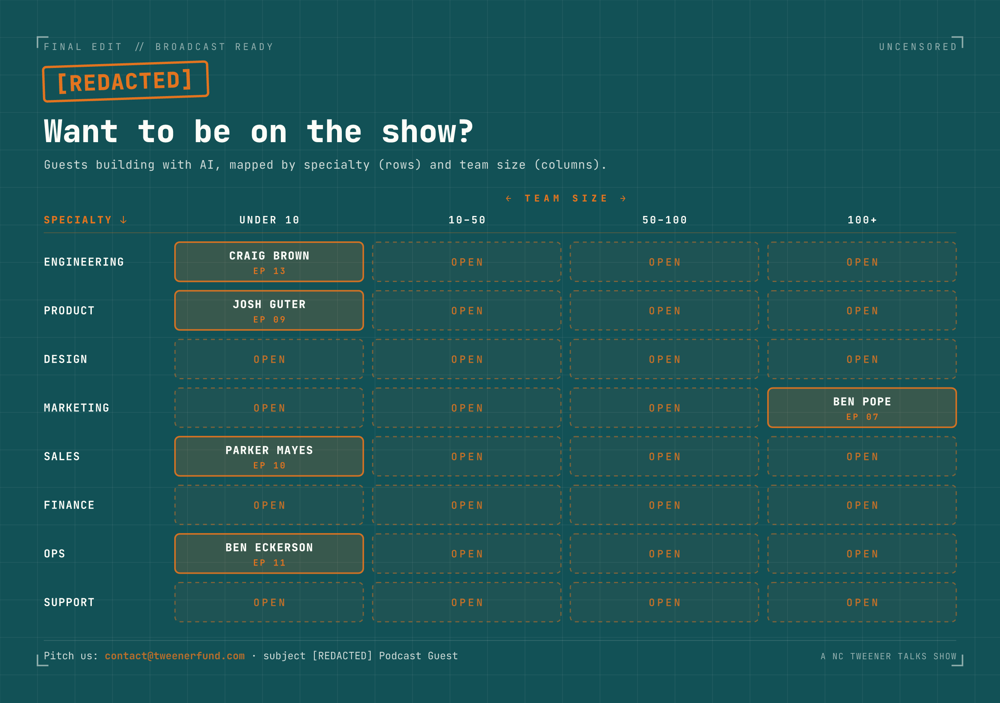

  

  
  
  
  

<b>AI builds your feed will never show you.</b>

---

## What is [Redacted]?

Most "how I AI" shows hide the messy middle. Clean demos, perfect workflows, everything works on the first try. **[Redacted] is the opposite.** We show the rebuilds, the dead ends, the stuff that broke, and the steps everyone else edits out. Hosted by **David Shaner** and **Taylor Cotner**, part of the NC Tweener Times network.

The name says it: guests share so much of what they're actually building that the sensitive parts get scrubbed in post.

This repo is the **companion**. Full show notes live with each episode (linked below); what's *here* are the actual files, skills, and workflows we reference on-air.

## Episodes

<table>
<tr>
<td width="300"></td>
<td valign="top">

### EP 06 · The 8-Stage "AI-ification Engine" Behind Every Automation Shipped
`2026-07-15` · 50:12

▶ [Watch](https://www.youtube.com/watch?v=oK4U0fkvqB8) · 🎧 [Apple](https://podcasts.apple.com/us/podcast/redacted-episode-6-the-8-stage-ai-ification-engine/id1774076494?i=1000776867749) · [Spotify](https://open.spotify.com/show/1aMrtX8LnIU2w5yoT4uolb) · 📝 [Show notes](https://www.tweenertimes.com/p/redacted-episode-6-the-8-stage-ai) · 📁 [Files](006-ai-ification-engine/)

</td>
</tr>
<tr>
<td width="300"></td>
<td valign="top">

### EP 05 · The Rage Log: AI-Powered Lead Gen, a Living Landing Page, and the Trick That Stops Claude From Making the Same Mistake Twice
`2026-07-01` · 48:20

▶ [Watch](https://www.youtube.com/watch?v=Pifilcj62Ks) · 🎧 [Apple](https://podcasts.apple.com/us/podcast/redacted-episode-5-the-rage-log-ai-powered-lead-gen/id1774076494?i=1000774957303) · [Spotify](https://open.spotify.com/show/1aMrtX8LnIU2w5yoT4uolb) · 📝 [Show notes](https://www.tweenertimes.com/p/redacted-episode-5-the-rage-log-ai) · 📁 [Files](005-the-rage-log/)

</td>
</tr>
<tr>
<td width="300"></td>
<td valign="top">

### EP 04 · We Stopped Using Claude Code Mid-Build. Here's What We Built Instead
`2026-06-17` · 41:36

▶ [Watch](https://www.youtube.com/watch?v=flnJJIhY_gk) · 🎧 [Apple](https://podcasts.apple.com/us/podcast/redacted-episode-4-we-stopped-using-claude-code-mid/id1774076494?i=1000773076948) · [Spotify](https://open.spotify.com/show/1aMrtX8LnIU2w5yoT4uolb) · 📝 [Show notes](https://www.tweenertimes.com/p/redacted-episode-4-we-stopped-using) · 📁 [Files](004-stopped-using-claude-code/)

</td>
</tr>
<tr>
<td width="300"></td>
<td valign="top">

### EP 03 · A Sentient HubSpot for $2 a Brand
`2026-06-03` · 44:29

▶ [Watch](https://www.youtube.com/watch?v=zWtqq6vLVmo) · 🎧 [Apple](https://podcasts.apple.com/us/podcast/redacted-episode-3-a-sentient-hubspot-for-%242-a-brand/id1774076494?i=1000770899963) · [Spotify](https://open.spotify.com/episode/3RZNYYcGNrdszcd8vH8mLF) · 📝 [Show notes](https://www.tweenertimes.com/p/redacted-episode-3-a-sentient-hubspot) · 📁 [Files](003-sentient-hubspot/)

</td>
</tr>
<tr>
<td width="300"></td>
<td valign="top">

### EP 02 · The AI Workflow Graveyard: CRMs, Agents, and... Tamagotchis?
`2026-05-20` · 38:41

▶ [Watch](https://www.youtube.com/watch?v=VFLEatgS6LA) · 🎧 [Apple](https://podcasts.apple.com/us/podcast/redacted-an-nc-tweener-times-podcast-the-ai/id1774076494?i=1000768692288) · [Spotify](https://open.spotify.com/episode/2HA4GttRJJW34OUnWW1NgV) · 📝 [Show notes](https://www.tweenertimes.com/p/redacted-the-ai-workflow-graveyard) · 📁 [Files](002-ai-workflow-graveyard/)

</td>
</tr>
<tr>
<td width="300"></td>
<td valign="top">

### EP 01 · What Happens When You Rebuild a Business With AI
`2026-05-06` · 48:06

▶ [Watch](https://www.youtube.com/watch?v=N1Zfxm0RQMs) · 🎧 [Apple](https://podcasts.apple.com/us/podcast/redacted-an-nc-tweener-times-podcast-what-happens/id1774076494?i=1000766388494) · [Spotify](https://open.spotify.com/episode/29qSabJig69TrEWYwolQNu) · 📝 [Show notes](https://tweenertalks.com/episodes/redacted-an-nc-tweener-times-podcast-what-happens-when-you-rebuild-a-business-with-ai) · 📁 [Files](001-rebuild-business-with-ai/)

</td>
</tr>
</table>

> Folders `008/`–`015/` are pre-created stubs. `007/` has companion files but isn't in the Episodes list until it launches. Each stub gets a title-slug name once the episode airs.

## Want to be on the show?

We're looking for builders doing genuinely interesting things with AI. Find your bucket. Every slot is open.

  

Pitch us at **contact@tweenerfund.com** (subject `[REDACTED] Podcast Guest`). Full details in [`want-to-be-on.md`](want-to-be-on.md).

## License

Content in this repo is licensed under [CC BY 4.0](LICENSE). Episode audio is not covered by this license.
