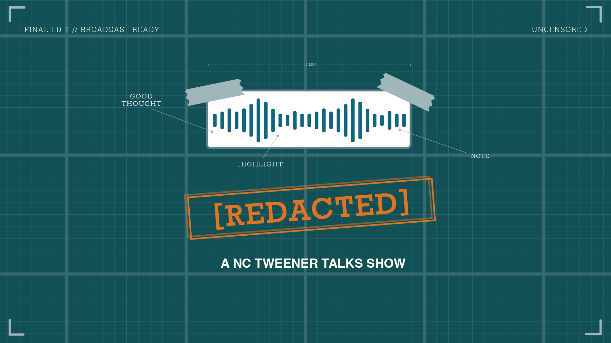

  

  <a href="https://davidmshaner.com/redacted">davidmshaner.com/redacted</a> ·
  <a href="https://www.tweenertimes.com/s/redacted">Substack</a> ·
  <a href="https://www.youtube.com/@NCTweenerTalks">YouTube</a>

---

# [Redacted] — the files

Companion repo for **[Redacted]**, an NC Tweener Times podcast hosted by David Shaner and Taylor Cotner. Most "how I AI" shows hide the messy middle; this one shows it. And when we share a file, skill, or workflow on the show, it lives here.

This repo is **not** a copy of the show notes. Full notes, summaries, and timestamps live with each episode (links below). What's here are the actual artifacts we reference on-air.

## Episodes

Each episode gets a numbered folder. Open it for that episode's files and a link to the full notes.

| #   | Episode | Folder |
| --- | ------- | ------ |
| 1   | What Happens When You Rebuild a Business With AI | [`001-rebuild-business-with-ai/`](001-rebuild-business-with-ai/) |
| 2   | The AI Workflow Graveyard: CRMs, Agents, and... Tamagotchis? | [`002-ai-workflow-graveyard/`](002-ai-workflow-graveyard/) |

Folders `003/`–`015/` are pre-created stubs; each gets a title-slug name once the episode airs.

## Want to be on the show?

We're looking for builders doing genuinely interesting things with AI. Find your bucket. Every slot is open.

  

Pitch us at **contact@tweenerfund.com** (subject `[REDACTED] Podcast Guest`). Full details in [`want-to-be-on.md`](want-to-be-on.md).

## License

Content in this repo is licensed under [CC BY 4.0](LICENSE). Episode audio is not covered by this license.
